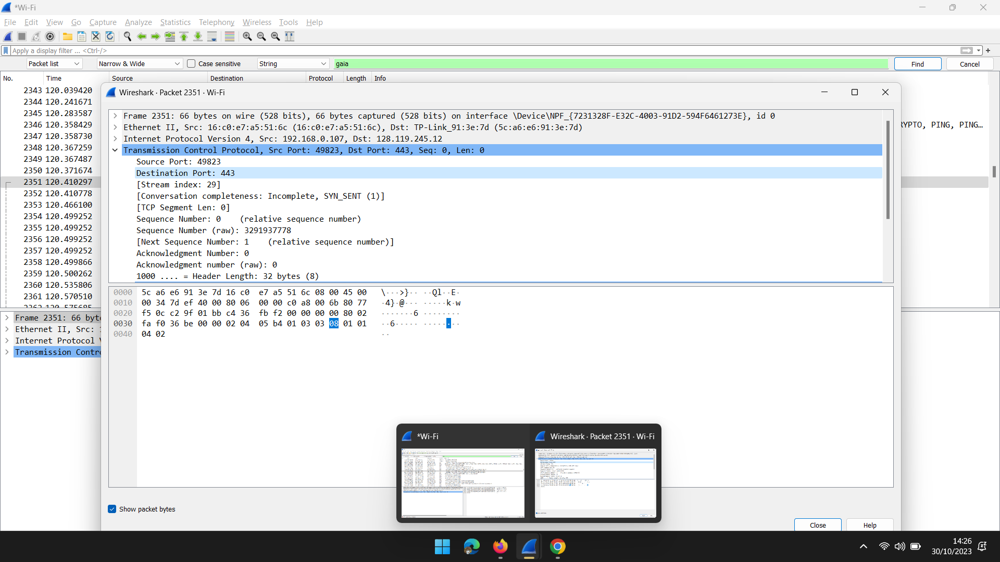
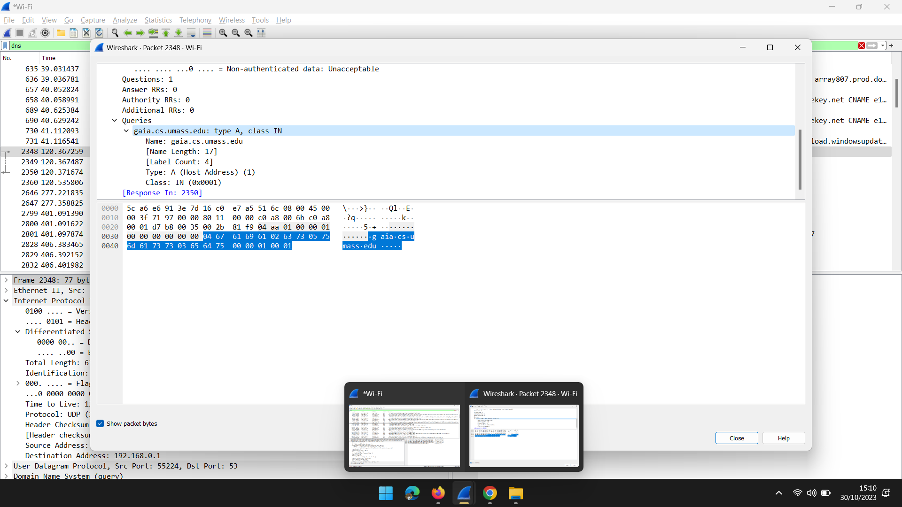

# Trabalho Prático com Wireshark

Este repositório contém um trabalho prático que envolve a utilização do software Wireshark para analisar protocolos de rede em diferentes camadas. O trabalho está dividido em quatro partes, e para cada parte, você encontrará instruções e questões específicas que precisam ser respondidas com base na captura de pacotes.

## Pré-requisitos

Certifique-se de ter o Wireshark instalado no seu computador. Você pode fazer o download do Wireshark em [Dowload Wireshark(https://www.wireshark.org/download.html).

## Instruções Gerais

- Cada parte do trabalho inclui um conjunto de questões que requerem análise das capturas de pacotes.
- Para cada questão, será necessário incluir capturas de tela relevantes que demonstrem sua análise.
- As capturas de tela devem ser inseridas diretamente no documento, indicando claramente a parte relevante da captura.
- Certifique-se de nomear adequadamente as capturas de tela para referenciá-las no documento.
- Siga as instruções fornecidas em cada parte do trabalho para realizar a análise apropriada.

## Conteúdo do Trabalho

### Parte 1 - Análise do Protocolo HTTP

-  O seu navegador executa a versão 1.0 ou 1.1 do HTTP? Qual a versão do HTTP que está rodando no
servidor?

*Meu navegador executa a versão 1.1 do HTTP. A versão do HTTP rodando no servidor é 1.1.*

- Quais linguagens (idiomas) o seu navegador indica que pode aceitar do servidor?

- Qual o endereço IP do seu computador? E do servidor gaia.cs.umass.edu?
- 
*O endereço IP do meu computador é 192.168.0.107. O endereço IP do servidor gaia.cs.umass.edu é 128.119.245.12*

- Qual aplicação (e versão) é utilizada pelo servidor web gaia.cs.umass.edu?

### Parte 2 - Análise do Protocolo TCP

- Qual é o número da porta TCP usada pelo seu computador cliente (source) para requisitar o arquivo
html para gaia.cs.umass.edu? E qual o número de porta TCP que o servidor gaia está usando para receber e enviar
essas respostas?

*O número da porta TCP usado pelo meu computador cliente (fonte) para solicitar o arquivo HTML é 49823. O número de porta TCP que o servidor Gaia está usando para receber e enviar essas respostas é 443*

- Mostre e comente o pacote que contém o segmento TCP SYN que caracteriza o início de uma
conexão TCP (estabelecimento inicial de conexão - three way handshake) entre o computador cliente e o
gaia.cs.umass.edu?

- Após responder à questão 2.2 mostre e comente o campo do segmento TCP que contém o tamanho
da janela utilizada pelo TCP para o controle de fluxo? Qual é o tamanho da janela em bytes?

*O campo do segmento TCP que contém o tamanho da janela utilizada pelo TCP para o controle de fluxo é 64240*

-  Identifique, abra e mostre o pacote do segmento TCP responsável pelo término da conexão. Qual é
a flag que o TCP usa para encerrar a conexão?

*O pacote do segmento TCP responsável pelo término da conexão tem o sinalizador "FIN" ativado.*

### Parte 3 - Análise do Protocolo DNS

- Identifique e comente a mensagem de consulta ao DNS para descobrir o IP do host
‘gaia.cs.umass.edu’. Qual foi o protocolo da camada de transporte utilizado?

*A mensagem de consulta DNS para descobrir o IP do host 'gaia.cs.umass.edu' usa o protocolo de transporte UDP.*

-  Após responder à questão 3.1 identifique e comente a porta destino usada para a consulta DNS?

*A porta de destino usada para a consulta DNS é a porta 53, que é a porta padrão para consultas DNS.*

- Qual é o endereço IP do servidor de DNS que foi usado para a resolução do endereço IP do host
‘gaia.cs.umass.edu’?

*O endereço IP do servidor de DNS usado para a resolução do endereço IP do host 'gaia.cs.umass.edu' é 128.119.245.12*

### Parte 4 - Análise do Protocolo Ethernet

- Após responder à questão 3.3, identifique e comente sobre o endereço MAC do seu computador?

*O endereço MAC do meu computador pode ser encontrado nas informações dos pacotes, na seção "Source" ou "Source MAC Address*

- Qual é o endereço MAC do host `gaia.cs.umass.edu`? Justifique e fundamente a sua resposta.

*O endereço MAC do host gaia.cs.umass.edu não pode ser determinado diretamente a partir da captura, uma vez que o Wireshark não captura o tráfego fora de sua rede local. Portanto, não é possível justificar esta resposta com base na captura disponível.*

## Conclusão

*Este trabalho prático utiliza o Wireshark para explorar diferentes protocolos de rede em várias camadas.*

--- 

